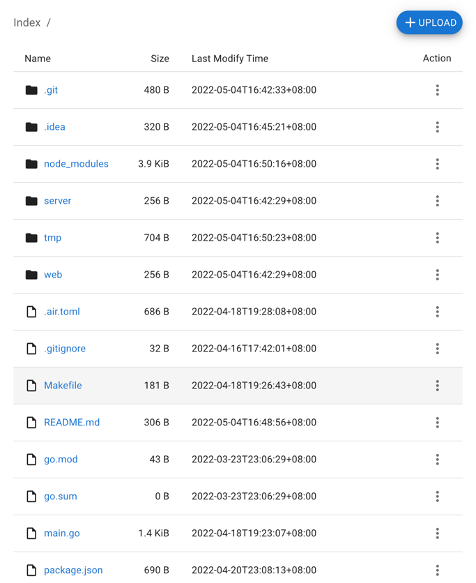
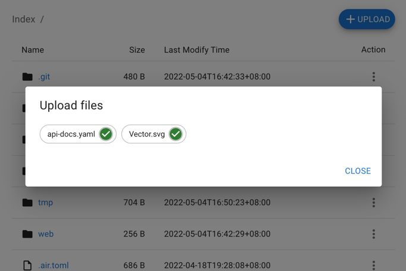

# fileserver

The `fileserver` can be used as a static file server to share your file to people and also can as a private file server to upload and download your private files.

## Features
- Directory index
- File download
- File upload
- HTTPS supported
- Web UI
- JSON API

## Usage
### API
1. Execute the following command will upload the `img.png` to the `image` directory on the file server and produces a file named `img.png`. If the `image` directory does not exist, it will be created.
    ```bash
    $ curl -T img.png http://localhost:8880/image/
    $ # or
    $ curl -F 'file=@img.png' http://localhost:8880/image/
    ```

2. Execute the following command will upload the `img.png` to the `image` directory on the file server and produces a file named `another.png`. If the `image` directory does not exist, it will be created.
    ```bash
    $ curl -T img.png http://localhost:8880/image/another.png
    $ # or
    $ curl -F 'file=@img.png' http://localhost:8880/image/another.png
    ```

### Web UI
**Index**
<div style="border: solid 1px">

</div>

**Upload**
<div style="border: solid 1px">

</div>

## Build
```bash
$ make build
```
It will be output a binary in the `tmp` directory named with `fileserver`

## Development
```bash
$ make dev
```
It will run a air server to watch code change and reload the server.