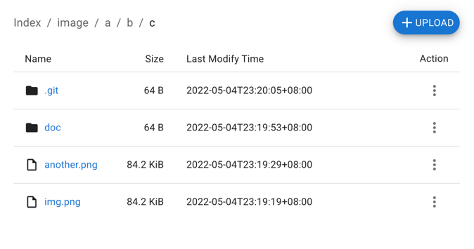
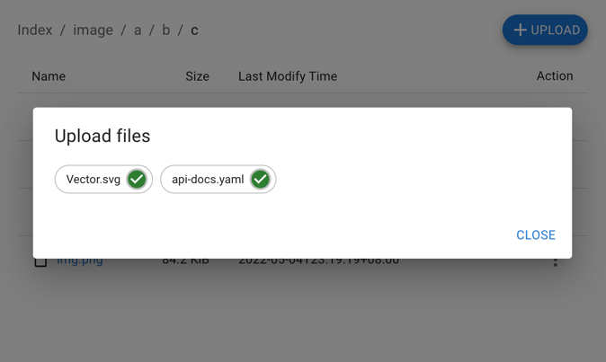

# fileserver

The `fileserver` can be used as a static file server to share your file and also can as a private file server to upload and download your private files.

## Features
- Directory index
- File download
- File upload
- HTTPS supported
- Web UI
- JSON API

## Usage
### API usage
**File upload - Using default file name**

Following command will upload the `img.png` to the directory `/image/a/b/c/` on the file server and produces a file named `img.png`.
 ```bash
 $ curl -T img.png http://localhost:8880/image/a/b/c/
 $ # or
 $ curl -F 'file=@img.png' http://localhost:8880/image/a/b/c/
 ```

**File upload - Specify file name**

Following command will upload the `img.png` to the directory `/image/a/b/c/` on the file server and produces a file named `another.png`.
 ```bash
 $ curl -T img.png http://localhost:8880/image/a/b/c/another.png
 $ # or
 $ curl -F 'file=@img.png' http://localhost:8880/image/a/b/c/another.png
 ```

> Note: 
> 1. If the specified directory does not exist on the file server, this directory will be created first.
> 2. If the file to be uploaded already exists on the file server, the file will be overwritten.

**File download**
```bash
$ curl http://localhost:8880/image/a/b/c/another.png
```

### UI usage
**Directory index**

The directory index access URL is the same as the API's access URL(Such as `http://localhost:8880/image/a/b/c/`). Just type the URL in the browser, and you'll see what's inside.

> 

**File upload**
> 

## Build
```bash
$ make build
```
It will be output a binary in the `tmp` directory named with `fileserver`

## Development
```bash
$ make dev
```
It will run a air server to watch code change and reload the server.