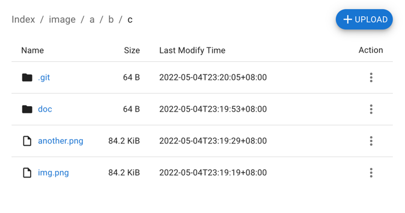
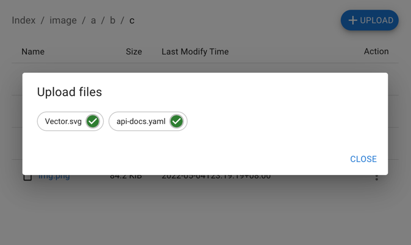

# fileserver

The `fileserver` can be used as a static file server to share your file and also can as a private file server to upload and download your private files.

## Features
- Directory index
- File download
- File upload (batch upload supported)
- Directory creation
- File/directory deletion (opt-in via `-allow-delete`)
- HTTPS supported
- Basic Auth
- Web UI
- JSON API

## Usage

### Start the server

```bash
# Basic usage
./fileserver -port 8880 -basedir /path/to/files

# With Basic Auth (default: only uploads / mkdir / delete need credentials; browsing is public)
./fileserver -port 8880 -basedir /path/to/files -auth "admin:secret"

# Require Basic Auth for every request (including reads)
./fileserver -port 8880 -basedir /path/to/files -auth "admin:secret" -auth-scope all

# With TLS
./fileserver -port 8443 -basedir /path/to/files -tls-cert cert.pem -tls-key key.pem

# With TLS and Basic Auth
./fileserver -port 8443 -basedir /path/to/files -tls-cert cert.pem -tls-key key.pem -auth "admin:secret"

# Enable deletion
./fileserver -port 8880 -basedir /path/to/files -allow-delete
```

#### Flags

| Flag       | Default | Description                  |
|------------|---------|------------------------------|
| `-port`    | `8880`  | Which port to listen on      |
| `-basedir` | `.`     | Which directory to serve     |
| `-tls-cert`| `""`    | TLS cert file location       |
| `-tls-key` | `""`    | TLS key file location        |
| `-auth`    | `""`    | Basic auth as `username:password` (password may contain `:`). Empty disables Basic auth |
| `-auth-scope` | `write` | With `-auth`: `write` = only POST/PUT/PATCH/DELETE need auth; `all` = every request needs auth |
| `-allow-delete` | `false` | Enable file/directory deletion |

### API usage

When Basic Auth is enabled, add `-u user:pass` to curl for requests that require credentials. With the default `-auth-scope write`, **GET/HEAD** (download, JSON listing) are usually anonymous; **POST** (upload, mkdir), **PUT**, and **DELETE** need `-u`. With `-auth-scope all`, add `-u` to every request.

**File upload - Using default file name**

Following command will upload the `img.png` to the directory `/image/a/b/c/` on the file server and produces a file named `img.png`.
 ```bash
 $ curl -T img.png http://localhost:8880/image/a/b/c/
 $ # or
 $ curl -F 'file=@img.png' http://localhost:8880/image/a/b/c/

 # With Basic Auth (upload is a write)
 $ curl -u admin:secret -T img.png http://localhost:8880/image/a/b/c/
 ```

**File upload - Specify file name**

Following command will upload the `img.png` to the directory `/image/a/b/c/` on the file server and produces a file named `another.png`.
 ```bash
 $ curl -T img.png http://localhost:8880/image/a/b/c/another.png
 $ # or
 $ curl -F 'file=@img.png' http://localhost:8880/image/a/b/c/another.png
 ```

> Note:
> 1. If the specified directory does not exist on the file server, this directory will be created first.
> 2. If the file to be uploaded already exists on the file server, the file will be overwritten.

**Create directory**
```bash
$ curl -X POST 'http://localhost:8880/path/to/?action=mkdir&name=new-folder'

# With Basic Auth
$ curl -u admin:secret -X POST 'http://localhost:8880/path/to/?action=mkdir&name=new-folder'
```

**File download**
```bash
$ curl http://localhost:8880/image/a/b/c/another.png

# Only needed if `-auth-scope all`; with default `write`, download is anonymous
$ curl http://localhost:8880/image/a/b/c/another.png
```

**Delete file or directory** (requires `-allow-delete`; with Basic Auth, DELETE is a write — add `-u` when `-auth` is set)
```bash
# Delete a file
$ curl -u admin:secret -X DELETE http://localhost:8880/path/to/file.txt

# Delete a directory (recursively)
$ curl -u admin:secret -X DELETE http://localhost:8880/path/to/dir/
```

**List directory (JSON)**
```bash
$ curl http://localhost:8880/path/to/dir/

# Only needed if `-auth-scope all`; with default `write`, JSON listing is anonymous
$ curl http://localhost:8880/path/to/dir/
```

### UI usage

**Directory index**

The directory index access URL is the same as the API's access URL(Such as `http://localhost:8880/image/a/b/c/`). Just type the URL in the browser, and you'll see what's inside.

> 

**File upload (batch)**

Click the "Upload" button to open the upload dialog. You can drag and drop or select multiple files for batch upload.

> 

**Create directory**

Click the "New Folder" button to create a new directory in the current path.

## Build
```bash
$ make build
```
It will output a binary in the `tmp` directory named `fileserver`.

## Development
```bash
$ make dev
```
It will run an air server to watch code change and reload the server.
